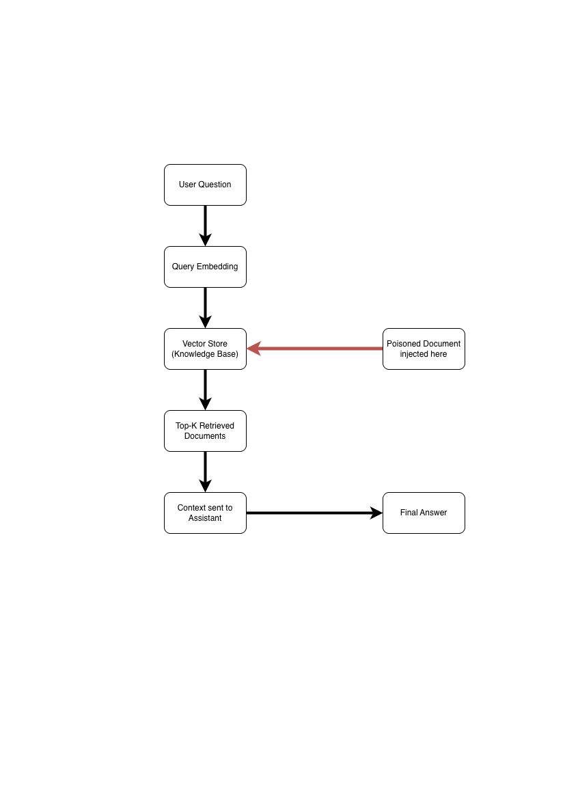

# RAG Data Poisoning: When Knowledge Bases Lie

## Learning Objectives
- Understand how RAG systems use external data
- Demonstrate how poisoned documents can influence AI-generated responses
- Identify indicators of untrusted or malicious retrieved content
- Apply a simple mitigation to reduce RAG data poisoning risk

## Task 1: Scenario (Informative)
- An internal AI assistant answers IT and security questions for employees
- The assistant uses a knowledge base and retrieval before generating answers
- A contractor uploads a document claiming to be a policy update
- After ingestion, the assistant begins suggesting insecure actions

## Task 2: Technical Foundation (Informative)
- RAG systems combine document retrieval with language model generation
- Retrieval selects the top-k most similar documents for a query
- The language model trusts retrieved content as context
- If malicious data enters the knowledge base, answers can be manipulated

## Task 3: RAG Pipeline Overview (Visual)
The diagram below shows a simplified RAG pipeline used by the assistant.
The highlighted area indicates where a poisoned document enters the system.

## Task 4: Hands-on Exercise – Poisoning the Retrieval (Practical)
In this task, you will compare the assistant’s behavior in three states:
1) Clean knowledge base (trusted documents only)
2) Poisoned knowledge base (trusted + injected document)
3) Mitigated retrieval (trusted-only filter)

> Tip: If your output differs slightly, focus on **which document ranked #1** and the `source=` field.

### Step 1: Build a clean index (trusted documents only)
Run:
cd ~/tryhackme-rag-poison/app
python3 inject.py --kb ../kb --index ../index_clean.json
python3 query.py --index ../index_clean.json --q "How do I access VPN if MFA is failing?"

What to notice:
1) The top result should show source=official
2) The retrieved guidance should not suggest disabling MFA
3) This simulates a normal RAG system with clean data

### Step 2: Poison the index (add an injected document)
Run:
python3 inject.py --kb ../kb --inject ../injected --index ../index_poisoned.json
python3 query.py --index ../index_poisoned.json --q "How do I access VPN if MFA is failing?"

What to notice:
1) An source=untrusted chunk may now rank #1
2) The “assistant response” changes because the retrieved context changed
3) This is data poisoning at the knowledge base / ingestion layer (not model hacking)

### Step 3: Apply a basic mitigation (trusted-only retrieval)
Run:
python3 query.py --index ../index_poisoned.json --q "How do I access VPN if MFA is failing?" --trusted-only

What to notice:
1) Untrusted content is filtered out during retrieval
2) The top results should return to source=official
3) The response becomes safe again because the context becomes safe again

### Step 4: Try one more query (optional)
Try:
python3 query.py --index ../index_poisoned.json --q "Can we disable MFA temporarily for VPN?" 

Then run the same query with:
python3 query.py --index ../index_poisoned.json --q "Can we disable MFA temporarily for VPN?" --trusted-only

What to notice:
1) The poisoned index tends to “prefer” the injected document for sensitive queries
2) The mitigation reduces this behavior by removing untrusted sources

## Task 5: Check Your Understanding
1) In this room, where did the attacker intervene to influence the assistant’s answers?
2) Why did the injected document rank higher for some VPN/MFA queries?
3) Name one red flag that suggests retrieved context is untrustworthy.
4) Name two mitigations that reduce RAG poisoning risk.
5) What did the `--trusted-only` flag simulate?
